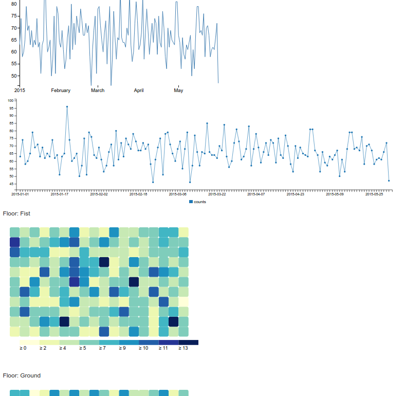

Simple python+flask API demo and d3/c3 data visualization.

Clone and do the setup:

```bash
mkvirtualenv flask-graphs
pip install -r requirements.txt
```

Run an app:

```bash
python application.py
```

Open API app: [http://localhost:5000/static/index.html](http://localhost:5000/static/index.html).

Or access API directly:

- data - [http://localhost:5000/data](http://localhost:5000/data)
- count - [http://localhost:5000/data/count](http://localhost:5000/data/count)
- heatmap - [http://localhost:5000/data/heatmap](http://localhost:5000/data/heatmap)

When application is started, it generates 10000 test data records.
Under the hood it uses super-simple in-memory database to store data, so if you re-start an app the data is lost.
To add more data - run `python generator.py` or POST data to /data endpoint:

```bash
curl -H "Content-Type: application/json" --data '[{
    "player": "Jack",
    "floor": "Ground",
    "position": {
        "x": 5,
        "y": 7
    },
    "ts": 1420070450
}]' http://localhost:5000/data
```

Sample data describes a game where we have some stats about players:
- player - player name
- floor - the floor player is on now (Underground, Ground, etc)
- position - current x/y player's position
- ts - current timestamp

Frontend is a pure html / js application.
It queries data via API and then displays a d3 line chart (based on [this](http://bl.ocks.org/mbostock/3883245) example) and a c3-based line chart.
Chars show count of players for each day.

Also frontend page displays heatmaps of visit count for each X,Y coordinate of each floor. Heatmap is based on [this example](http://bl.ocks.org/tjdecke/5558084).
If you hover a heatmap cell the tooltip will show X,Y and count of visits.

The frontend page looks like this:


